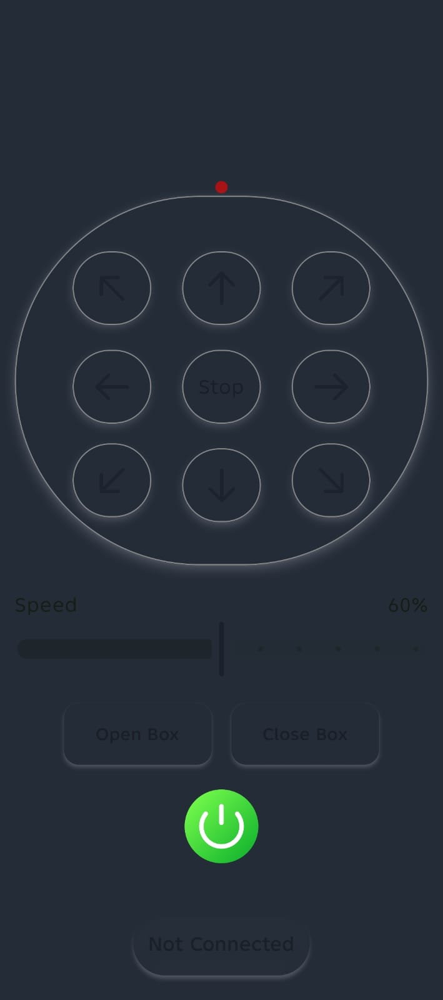
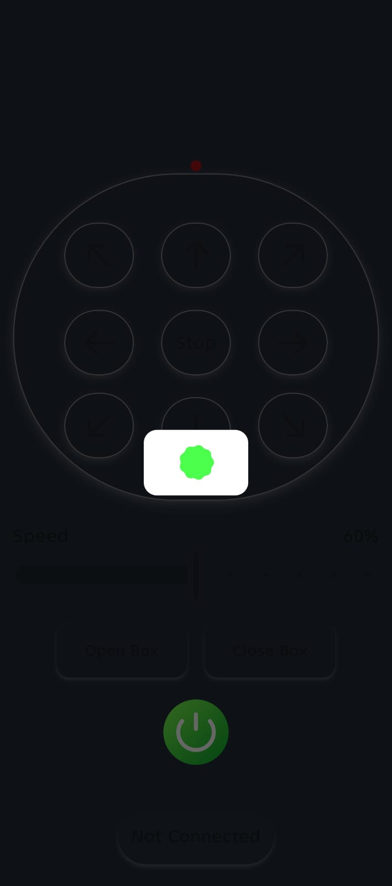
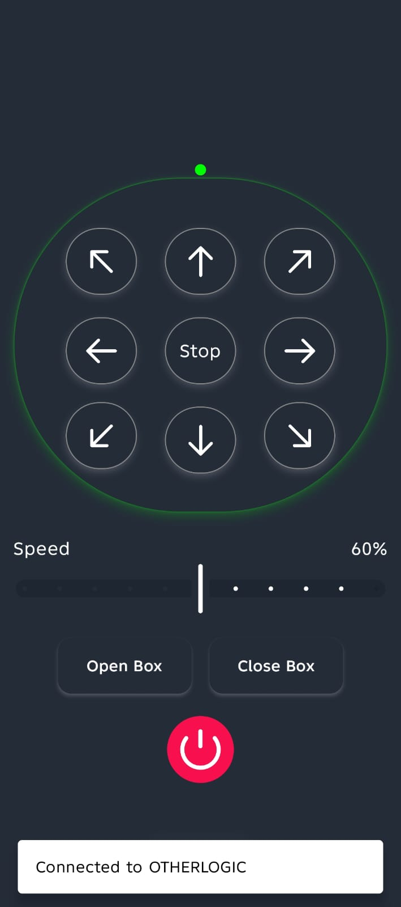
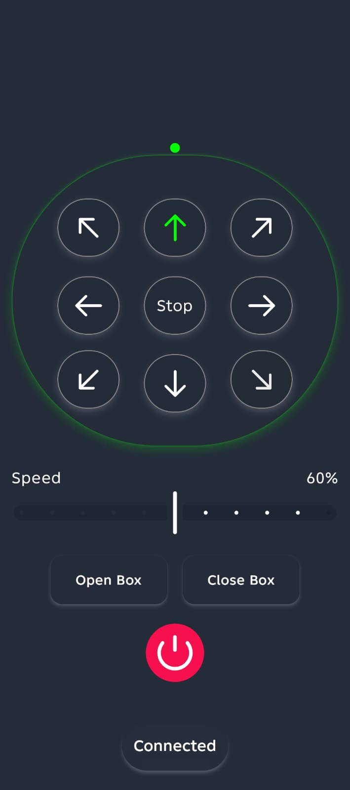
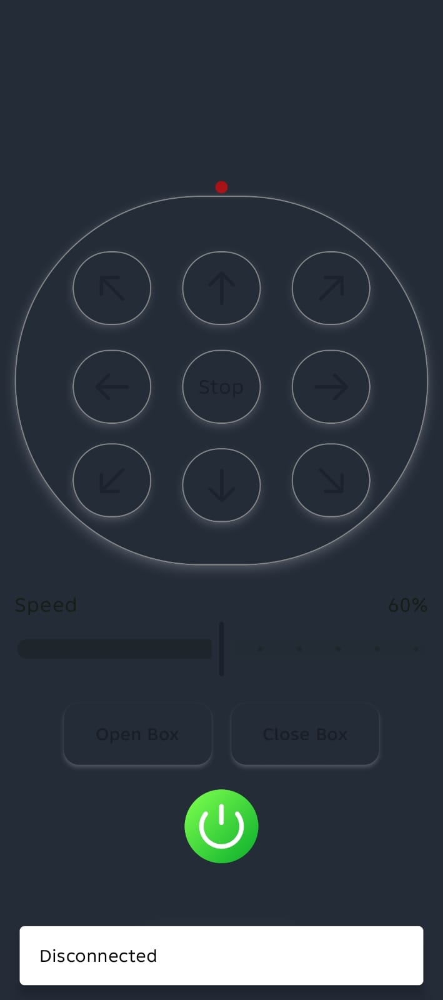

# Robot Controller App

An Android application built with **Jetpack Compose** to remotely control a robot over **Bluetooth (SPP/RFCOMM)**.  
The app provides real-time directional controls, speed adjustment, and connection management with a clean and responsive UI.

---

## Features
- Bluetooth SPP (RFCOMM) connection to a bonded device
- Directional robot controls (forward, backward, left, right, diagonals)
- Speed control with predefined levels
- Open / Close box actions
- Connect / Disconnect handling
- Full-screen immersive mode
- Real-time connection status and user feedback (Snackbars)

---

## Tech Stack
- **Language:** Kotlin  
- **UI:** Jetpack Compose, Material 3  
- **Architecture:** State-based UI with StateFlow & SharedFlow  
- **Concurrency:** Kotlin Coroutines  
- **Connectivity:** Bluetooth Classic (SPP / RFCOMM)  
- **Other:** Runtime permissions (Android 12+), WindowInsets (Immersive Mode)

---

## How It Works
- The app connects to a paired Bluetooth device using the Serial Port Profile (SPP).
- Each robot action is mapped to a single-character command and sent through a Bluetooth socket output stream.
- UI state (connection/loading) is driven by `StateFlow`, while one-time events are emitted via `SharedFlow`.

---

## Requirements
- Android device with Bluetooth support
- Paired Bluetooth device (robot / HC-05 / testing device)
- Android 8.0+ (recommended)
- Bluetooth permission granted (Android 12+)

---

## Notes
- The Bluetooth device name is currently hardcoded for testing purposes.
- This project focuses on the Android client-side implementation.

---

## Screenshots

  
  
  
  
  

